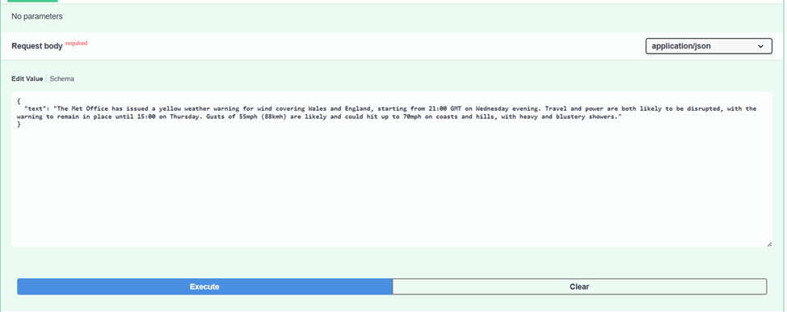

# ML Summarizer Service (T5-small)

Веб-сервис для автоматической генеративной суммаризации текстов на базе архитектуры Transformer (модель T5).

## О проекте
Сервис принимает на вход длинные текстовые фрагменты и генерирует краткие, связные аннотации. 
В основе лежит модель **T5-small**, прошедшая процедуру fine-tuning на датасете **XLSum** (86k примеров).

### Ключевые особенности
* **Framework:** FastAPI (асинхронная обработка).
* **ML Core:** Hugging Face Transformers.
* **Architecture:** Singleton-паттерн для загрузки модели (экономия RAM).
* **Validation:** Строгая типизация данных через Pydantic.
* **Storage:** Веса модели автоматически загружаются из [Hugging Face Hub](https://huggingface.co/Artemkaaa/t5-small-summarizer-xlsum).

## Технологический стек
* **Python 3.10+**
* **FastAPI / Uvicorn**
* **PyTorch**
* **SentencePiece & Protobuf** (для токенизации T5)

## Установка и запуск

1. **Клонируйте репозиторий:**
    ```bash
    git clone [https://github.com/Artarcadman/ML_Summarizer](https://github.com/Artarcadman/ML_Summarizer.git)
    cd ML_Summarizer

2. **Установите зависимости:**
    ```bash
    pip install -r requirements.txt

3. **Запустите сервер**
    ```bash
    python -m uvicorn main:app --reload

### Использование 
После запуска сервис доступен по адресу: http://127.0.0.1:8000  
Перейдите по адресу: http://127.0.0.1:8000/docs



### Структура ответа  

Сервис возвращает JSON следующего вида:

* **summary: Сгенерированный краткий текст**

* **original_text_length: Длина исходного текста (в символах)**

* **summarized_text_length: Длина полученной аннотации**

* **model_name: Идентификатор используемой модели**

## Результаты обучения

Количество шагов: 10k

Final Validation Loss: 0.54.

Датасет: XLSum (для английского языка).

Время обучения: ~1 час на GPU.